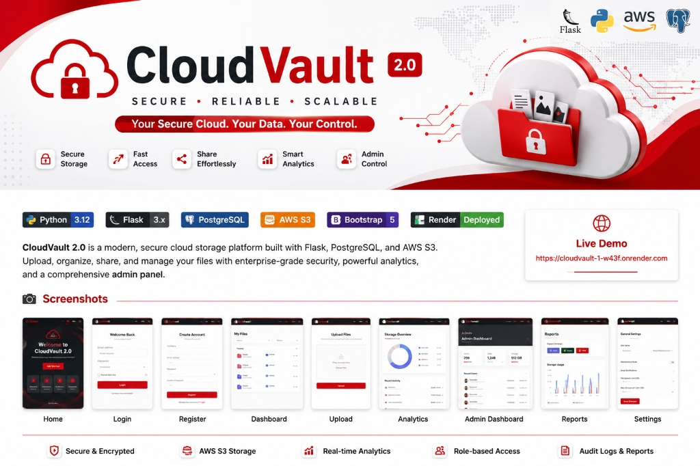
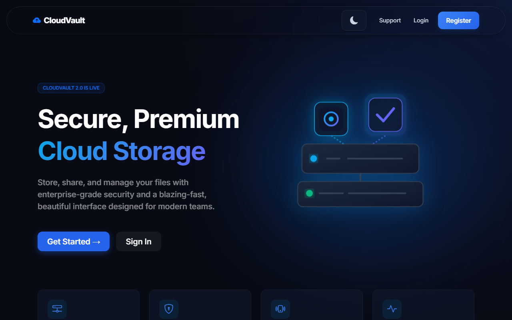
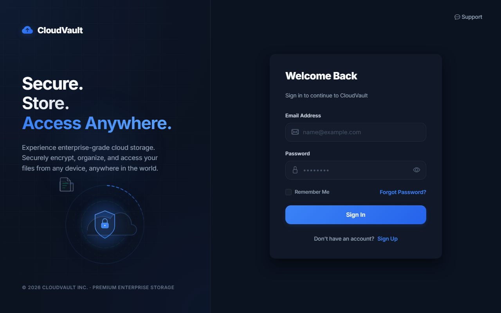
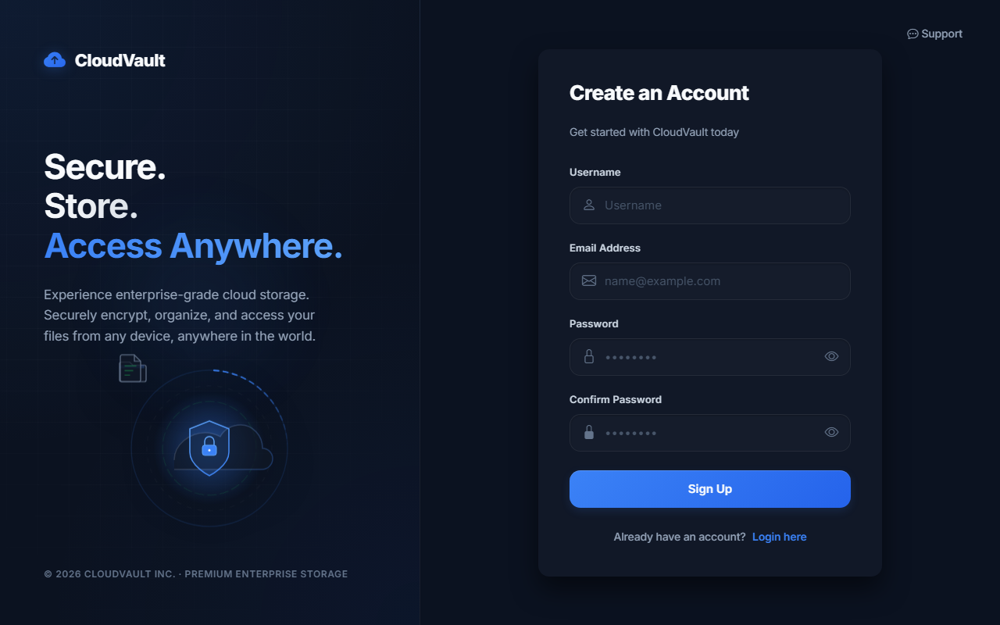
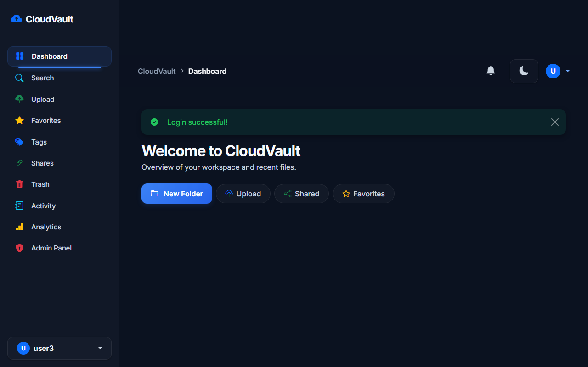
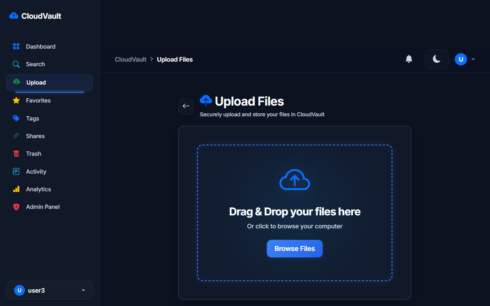
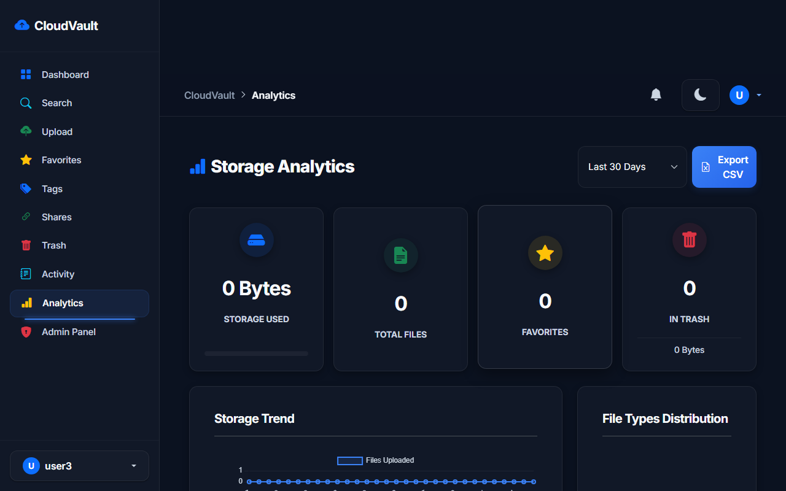
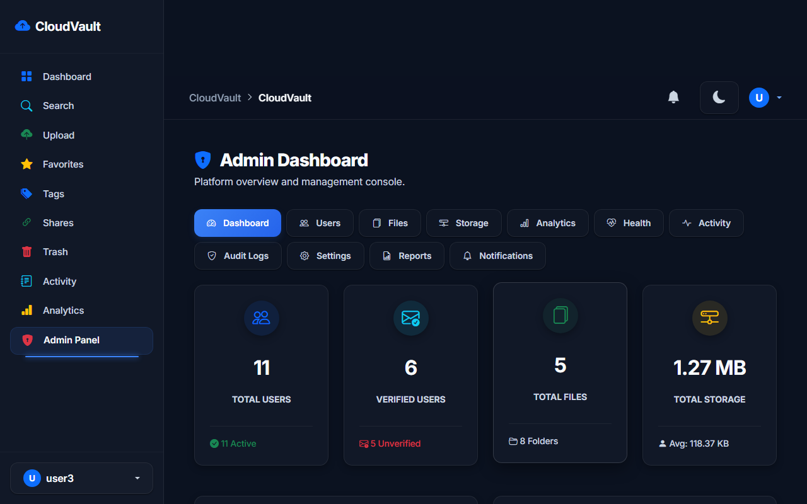
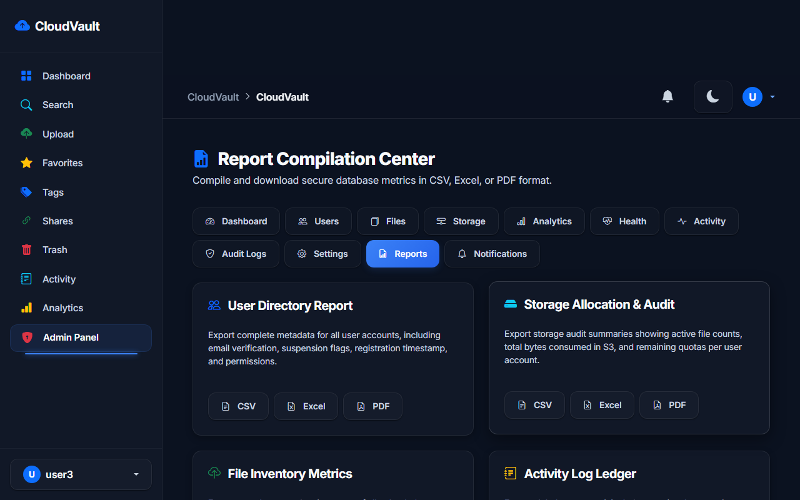
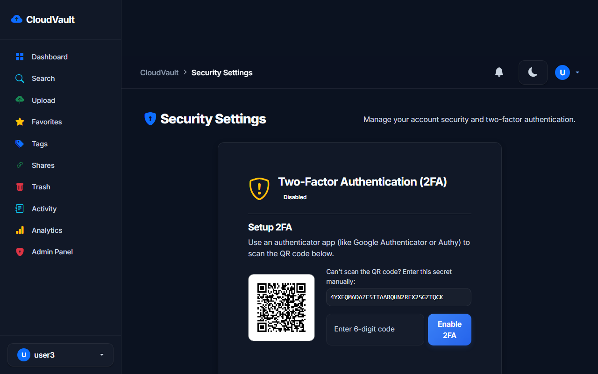

  

# ☁️ CloudVault

CloudVault is a secure cloud storage web application built with Python and Flask. It allows users to upload, organize, preview, share, and manage files through a modern web interface with enterprise-inspired features.

## 🚀 Live Demo
https://cloudvault-1-w43f.onrender.com

## ✨ Features

- 🔐 User Authentication
- 📁 Folder Management
- ☁️ File Upload & Download
- ⭐ Favorites
- 🔗 Secure File Sharing
- 🔔 Notifications
- 🖼️ Image & File Preview
- 🏷️ Tags & Labels
- 🔍 Advanced Search
- 📊 Storage Analytics Dashboard
- 🔑 API Keys
- 💾 Backup & Restore
- 📱 Responsive UI
- 🌙 Dark Mode

## 📷 Screenshots

### Home Page

  

### Login Page

  

### Register Page

  

### User Dashboard

  

### Upload File

  

### Storage Analytics

  

### Admin Dashboard

  

### Admin Reports

  

### Security Settings

  

## 🛠️ Tech Stack

### Backend
- Python
- Flask
- SQLAlchemy

### Database
- PostgreSQL (Neon)

### Frontend
- HTML
- CSS
- JavaScript
- Bootstrap

### Cloud & Deployment
- AWS S3
- Render
- Gunicorn

## 📦 Deployment

- Application Hosted on Render
- Database Hosted on Neon PostgreSQL

## 👨‍💻 Author

**Mano Bala**

GitHub:
https://github.com/Manobala27
